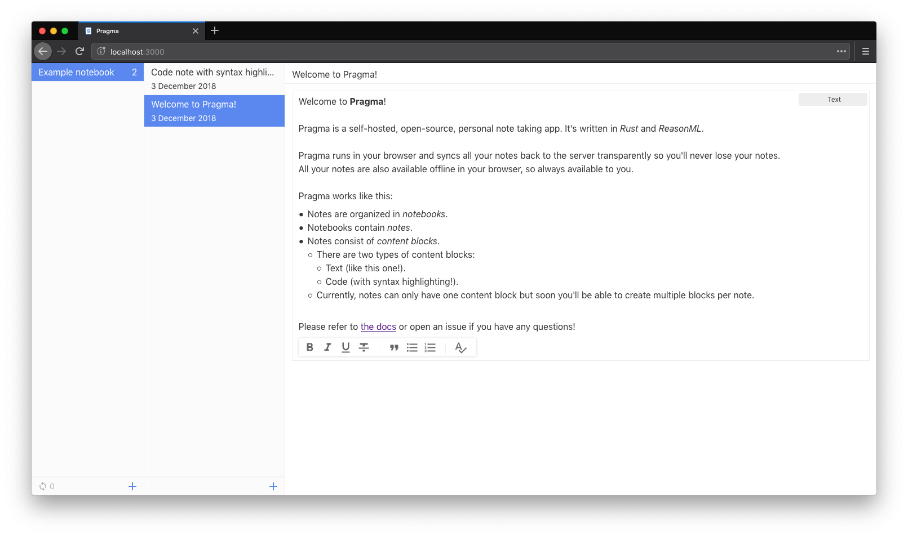
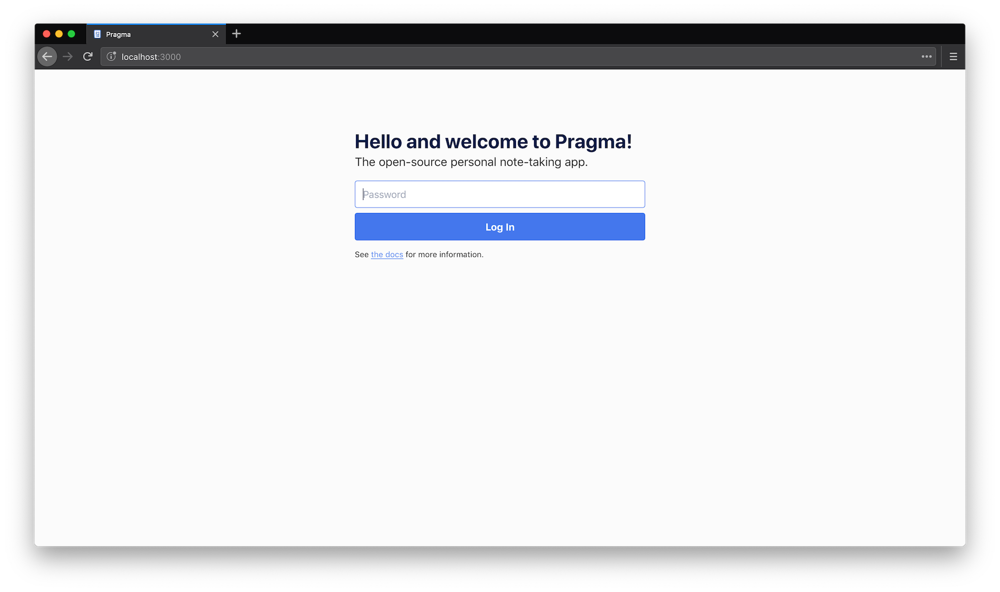
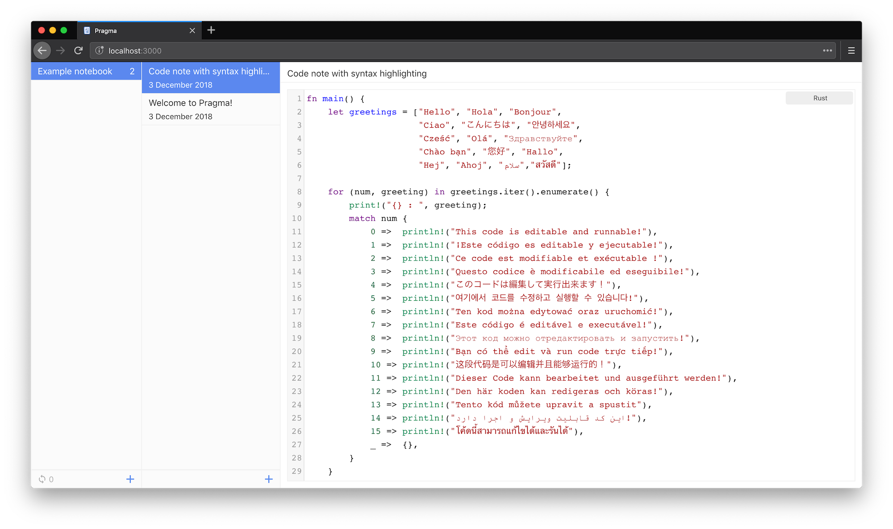

# Pragma

### A self-hosted, personal note taking app.

Pragma runs in your browser and syncs all your notes back to the server transparently so you'll never lose your data.
All your notes are also available offline in your browser, so always available to you.

## Features

* Browser-based note taking, offline.
* Self hosted; you own all your data.
* Lightweight. The sync server is written in Rust and takes only ~ 5-8 MB of memory.
* Super easy to host, it's just a single binary!
* WYSIWYG editor for text notes.
* Code editor with syntax highlighting for code snippets.

## Public demo

A demo instance is available at [pragma-demo.pascalw.me](https://pragma-demo.pascalw.me), login with password `demo`. Data in this instance is reset every 24 hours.

## Hosting

Pragma is designed to be hosted on a server and accessed via your webbrowser. Instructions are available for hosting on [Linux](./docs/hosting-linux.md) and [Docker](./docs/hosting-docker.md).

## Roadmap

- [ ] Checkboxes in text editor.
- [ ] Keyboard shortcuts.
- [x] Easy access to recent notes.
- [ ] Quick open / search.
- [ ] Mobile friendly.
- [ ] File attachments
- [ ] Sync conflict resolution.
- [ ] (Anonymous) note sharing.

See the [development board](https://github.com/pascalw/pragma/projects/1) for details.

## Known issues

- Only tested on Chrome, Firefox and Safari.
- No sync conflict resolution yet (see roadmap).
  - Currently, last write wins. You'll only run into this if you edit the same note from multiple devices at the same time.

